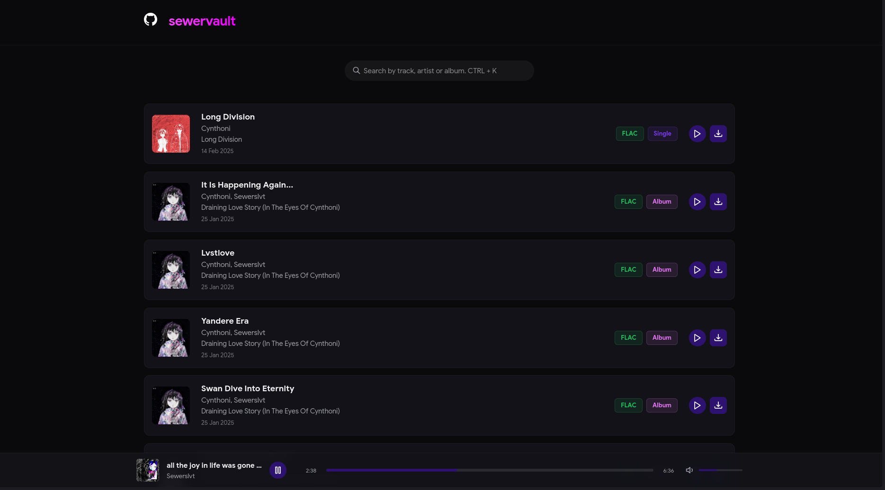

# Sewervault

A simple music download website created as an experiment using Claude 3.7


[](preview.png)

## JSON Structure

Site uses .json as database for tracks
```json
{
  "id": 1,
  "title": "Track Name",
  "artist": "Artist Name", 
  "album": "Album Name",
  "type": "Album|EP|Single",
  "format": "FLAC|MP3",
  "releaseDate": "YYYY-MM-DD",
  "coverPath": "cover.jpg",
  "filePath": "track.flac"
}
```
Tracks are sorted by *releaseDate* (newest first), then by ID if dates match.
Cover images are stored in `covers/` directory, music files in `music/` directory.
